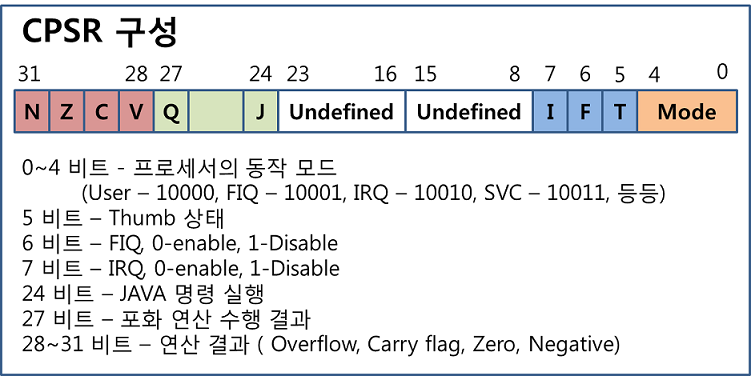

# Assembly
- 문법을 공부한다.
- 대, 소문자 상관없다.
- Rs : Register Source
- Rd : Register Destination


문법들
- .equ == #define
- @    == comment
- \__start:  == 어셈블리 문법이 시작되는 곳.

--------------------------

## MOV
- MOV dst, src
  - MOV R0, R1
  - (C) R0 = R1;

--------------------------

## Load
- 메모리에 있는 내용을 레지스터로 가져다 놓음.
- 메모리 => 레지스터
- LDR : Load to Register

### 상수 값을 레지스터로 Load
- LDR Rn, = value
  - ex)
    - LDR R0, = 100
    - LDR R15, = -0x1fff <-- R15는 PC용 레지스터이므로, 이 문장이 의미하는 바는 **분기문** 이다.

- Address label
  - label은 모든 주소 값이 된다.
  - ex)  
  ```avrasm
      HERE: MOV R0, #10  
            STR R0, [R1]  
            LDR PC, =HERE  
  ```

### 레지스터 간접참조 LDR
- LDR Rd, [Rs]
- C로 표현해보자면 다음과 같다.
  - int * Rs = xxx;
  - int Rd = \*Rs;

--------------------------
## Store
- 레지스터에 있는 내용을 메모리로 가져다 놓음.
- 레지스터 => 메모리
- STR : Store from Register

### 레지스터 간접참조 STR
- STR Rs, [Rd]
- C로 표현해보자면 다음과 같다.


--------------------------
## GPIO
- GPIO : 프로세서에서 원하는 논리 레벨을 출력하거나 입력상태의 읽을 수 있는 핀.
  - 여러개의 GPIO핀을 묶어서 관리한다.(Port)
- IC집적기술은 발달하지만 물리적으로 pin을 만들 수 있는 조건은 한정되어 있다.
  - 이러한 문제를 MUX를 통해서 해결하였다.

- GPIO 핀을 키기 위해서는 2단계를 거쳐야 한다.

```avrasm

@=================  
@ I/O PORT for LED  
@=================  
	.equ	GPBCON		,	 0x56000010		@Port B	control  
	.equ	GPBDAT		,	 0x56000014		@Port B	data  

  - GPBCON
    @ LED=GPB[10:7]  
    @ GPBCON Register configuration  
    LDR R0, =GPBCON  
    LDR R1, =0X00154000  
    STR R1, [R0]   @store r1 value into r0 designated memory

  - GPBDAT
    @ GPBDAT Register config  
    LDR R0, =GPBDAT  
    LDR R1, =0x300  
    STR R1, [R0]  
```


----------------

## 연산군
### +, - 연산군
- ADD
- ADC
- SUB
- RSB
- RIC

### 비트 연산군
- AND
- ORR
- EOR
- BIC

### MOV 연산군
- MOV
- MVN

### 비교 연산군
- CMP
- CMN
- TEQ
- TST


----------

## \# Value
- **# Value** 의 용법
- \# Value를 사용하면, 명령어에 데이터를 포함시킬 수 있다.


## 분기명령어 ( B )

```avrasm

B add  @ label이 add로 붙여진 곳으로 이동한다.
B 3f   @ local label의 이름이 3으로 붙여진 곳 중, 전방방향으로 가장 가까운 곳으로 이동한다.

B .    @ 무한 루프를 형성.

B R0   @ 분기의 주소로 레지스터를 사용할 수 없다.

```

## Label
- 파일 내에서 명령어들을 구분시키는 고유한 표식.
- label을 만들때에는 파일내에서 중복되지 않도록 선언해야 한다.
- 파일 내의 label은 다른 파일에서 참조하지 못한다.
- 만약에 다른 파일에서 참조하고 싶다면, 추가적인 지시자를 통해서 label의 접근 여부를 설정해줘야한다.
  - 이러한 역할을 하는 예약어를 **지시자(Directive)** 라고 한다.
  - ``` .global ADD ``` : 다른 파일에서 **ADD** 라는 레이블을 참조할 수 있도록 허용한다.
  - ``` .extern ADD ``` : 다른 파일에서 **ADD** 라는 레이블이 선언되어 있는 것을 참조할때 쓰는 명령어이다.
- 분기의 위치에 따라 Global과 Local이 가능하다.

## Global label

```avrasm

R0에 100이라는 값을 넣은 후, SUB Label이 붙은 곳으로 이동한다.

SUB:
    MOV R0, #100
    B SUB

```

## Local Label

```avrasm

1: mov r1, #200
1: mov r0, #100
  b 1b            @ 후방에서 가장 가까운 1 local label로 분기.
2:
  sub r0, r0, r1

  b 2f            @ 전방에서 가장 가까운 2 local label로 분기.

2: str r0, [r1]

```


------------------
## CPSR(Current Program Status Register)
- 현재의 상태를 저장하고 있는 레지스터.
- CPSR의 구성은 다음과 같다. 각 비트별로 역할이 다르다.

- N : Negative, 연산 결과가 음수인 경우 1로 set된다.
- Z : Zero, 연산 결과가 0인 경우 1로 set
- C : Carry, 연산결과에 캐리가 발생할 경우 1로 set
- V : oVerflow, **signed 덧셈, 뺄셈** 의 연산결과로 값의 초과(오버플로우)가 발생할 경우


## 비교연산 명령( CMP, CMN, TST, TEQ ) ==> CPSR레지스터의
- CMP Rs, OP2
  - Compare명령어는 기본적으로 2개의 operand의 차이를 계산해서 대소를 비교하는 명령어이다.
  - 대소를 비교하는 식은 다음과 같다.
  - Rs - OP2
  - CMP명령어는 2개의 operand의 차이를 구한 다음 CPSR의 flag만 변경시킨다.
    - Rs > OP2  : N flag 0, Z flag 0
    - Rs < OP2  : N flag 1, Z flag 0
    - Rs == OP2 : N flag 0, Z flag 1
  - 저장이 없는 SUBS 명령어와 같다.
  - !!중요!!, SUB명령어와 차이가 있다.

- CMN Rs, OP2
  - CMN명령어는  기본적으로 2개의 operand의 합을 계산해서 대소를 비교하는 명령어이다.
  - 단 이때, CMP와의 차이점은 operand2개의 합의 결과물을 사용한다는 점이다.
  - 대소를 비교하는 식은 다음과 같다.
  - Rs + OP2
  - CMP명령어는 2개의 operand의 차이를 구한 다음 CPSR의 flag만 변경시킨다.
    - Rs > OP2  : N flag 0, Z flag 0
    - Rs < OP2  : N flag 1, Z flag 0
    - Rs == OP2 : N flag 0, Z flag 1
  - 저장이 없는 ADDS 명령어와 같다.
  - !!중요!!, ADD명령어와 차이가 있다. ==> ADD 명령어는 상태 플래그에 대한 업데이트가 없다.

- TST
  - Test의 약자.
  - 특정 비트의 값이 1인지 0인지 파악하는 코드
  - if(a & 1<<7)
  - AND R0, R1, #1<<7
  - TST R1, #1<<7
  - TST연산의 결과로 해당 비트가 0임이 판정되면, 전체 값이 0이 되어, Z flag가 1로 set된다.

## CPSR의 상태 플래그들이 의미하는 것.

- **주의** CPSR의 상위 4비트는 **비교 명령 조건 판단에 따라 총 15가지 조건이 나오게 된다.**
- 
